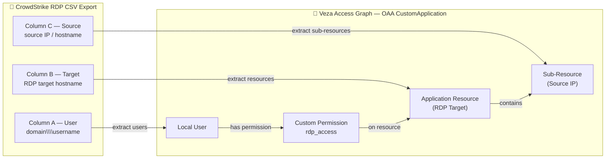

# Odam RDP → Veza OAA Integration

Reads CrowdStrike RDP session export CSV(s) and pushes identity and permission data into Veza's Access Graph via the Open Authorization API (OAA).

---

## 1. Overview

| Item | Value |
|---|---|
| **Data source** | CrowdStrike RDP session CSV export |
| **Provider name** | `Odam RDP` |
| **Datasource name** | `CrowdStrike RDP Sessions` |
| **Script** | `odam-rdp.py` |
| **OAA template** | `CustomApplication` |

### Entity model

| CSV Column | Field | OAA Entity | Notes |
|---|---|---|---|
| A | `User` | Local User | Full domain\\username (e.g. `WESTROCK\svcSQL-4518`) |
| B | `Target` | Application Resource (`RDP Target`) | Target hostname the user RDP'd to |
| C | `Source` | Sub-Resource (`Source IP`) | Source IP or hostname the session originated from; `null` rows are skipped |

### OAA permission mapping

| Permission name | OAA semantic permissions |
|---|---|
| `rdp_access` | `DataRead`, `MetadataRead` |

---

## 2. Entity Relationship Map



---

## 3. How It Works

1. **Load CSV** — reads all `.csv` files from `--data-dir` (or a single file via `--csv-file`).
2. **Normalise** — strips leading/trailing whitespace; skips rows where User or Target is empty; treats `null` Source as unknown (omitted from sub-resources).
3. **Deduplicate** — each User, Target, and Source is registered only once regardless of how many rows reference it.
4. **Build payload** — creates a `CustomApplication` with Local Users, Application Resources, Sub-Resources, and the `rdp_access` permission assigned from each user to each target they appear with in the CSV.
5. **Push** — calls `OAAClient.push_application()` with `create_provider=True` so the provider is auto-created on first run.

---

## 4. Prerequisites

- Python 3.8+ (3.9+ recommended)
- Linux or macOS (installer tested on RHEL/CentOS/Fedora and Ubuntu/Debian)
- Network access to your Veza tenant (`VEZA_URL`)
- A Veza API key with **OAA write** permissions
- CrowdStrike RDP CSV export with columns: `User`, `Target`, `Source`

---

## 5. Quick Start (one-command installer)


```bash
curl -fsSL https://raw.githubusercontent.com/andrewmusto-git/OdamRDP/main/integrations/odam-rdp/install_odam-rdp.sh | bash
```

**Non-interactive (CI/automation):**

```bash
VEZA_URL=https://example.veza.com \
VEZA_API_KEY=your_api_key_here \
bash install_odam-rdp.sh --non-interactive

```

---

## 6. Manual Installation

### RHEL / CentOS / Fedora / Amazon Linux

```bash
sudo dnf install -y git python3 python3-pip
git clone https://github.com/andrewmusto-git/OdamRDP.git
cd OdamRDP/integrations/odam-rdp
python3 -m venv venv
source venv/bin/activate
pip install -r requirements.txt
cp .env.example .env
chmod 600 .env
# Edit .env with your Veza credentials
```

### Ubuntu / Debian

```bash
sudo apt-get update && sudo apt-get install -y git python3 python3-pip python3-venv
git clone https://github.com/andrewmusto-git/OdamRDP.git
cd OdamRDP/integrations/odam-rdp
python3 -m venv venv
source venv/bin/activate
pip install -r requirements.txt
cp .env.example .env
chmod 600 .env
# Edit .env with your Veza credentials
```

### .env Configuration

```bash
# Veza credentials (required)
VEZA_URL=https://your-tenant.veza.com
VEZA_API_KEY=your_veza_api_key_here

# Optional: path to CSV export directory (default: ./samples/)
# DATA_DIR=/path/to/crowdstrike/exports

# Optional: override OAA labels
# PROVIDER_NAME=Odam RDP
# DATASOURCE_NAME=CrowdStrike RDP Sessions
```

---

## 7. Usage

```
python3 odam-rdp.py [OPTIONS]
```

| Argument | Required | Values | Default | Description |
|---|---|---|---|---|
| `--env-file` | No | path | `.env` | Path to environment file |
| `--veza-url` | No* | URL | `VEZA_URL` env var | Veza tenant URL |
| `--veza-api-key` | No* | string | `VEZA_API_KEY` env var | Veza API key |
| `--data-dir` | No | path | `./samples/` | Directory of CSV export(s) |
| `--csv-file` | No | path | — | Single CSV file (overrides `--data-dir`) |
| `--provider-name` | No | string | `Odam RDP` | Provider label in Veza |
| `--datasource-name` | No | string | `CrowdStrike RDP Sessions` | Datasource label in Veza |
| `--dry-run` | No | flag | false | Build payload, skip Veza push |
| `--save-json` | No | flag | false | Save OAA payload JSON to disk |
| `--log-level` | No | DEBUG\|INFO\|WARNING\|ERROR | `INFO` | Logging verbosity |

*Required unless `--dry-run` is set.

### Examples

```bash
# Standard run
python3 odam-rdp.py --env-file .env

# Process a specific CSV file
python3 odam-rdp.py --env-file .env --csv-file /data/exports/rdp_sessions.csv

# Dry-run with JSON payload saved
python3 odam-rdp.py --dry-run --save-json --csv-file ./samples/Odam-CrowdStrike-OAA.csv

# Debug logging
python3 odam-rdp.py --env-file .env --log-level DEBUG
```

---

## 8. Deployment on Linux

### Service account

```bash
sudo useradd -r -s /bin/bash -m -d /opt/odam-rdp-veza odam-rdp-veza
sudo chown -R odam-rdp-veza:odam-rdp-veza /opt/odam-rdp-veza
```

### File permissions

```bash
chmod 600 /opt/odam-rdp-veza/scripts/.env
chmod 700 /opt/odam-rdp-veza/scripts
```

### SELinux (RHEL)

```bash
getenforce   # check current mode
sudo restorecon -Rv /opt/odam-rdp-veza/
```

### Cron scheduling

Create a wrapper script at `/opt/odam-rdp-veza/scripts/run.sh`:

```bash
#!/bin/bash
cd /opt/odam-rdp-veza/scripts
source venv/bin/activate
python3 odam-rdp.py --env-file .env --log-level INFO
```

Add to `/etc/cron.d/odam-rdp-veza`:

```cron
# Odam RDP → Veza OAA — run every 6 hours
0 */6 * * * odam-rdp-veza /opt/odam-rdp-veza/scripts/run.sh >> /opt/odam-rdp-veza/logs/cron.log 2>&1
```

### Log rotation

Create `/etc/logrotate.d/odam-rdp-veza`:

```
/opt/odam-rdp-veza/logs/*.log {
    daily
    rotate 14
    compress
    missingok
    notifempty
    create 640 odam-rdp-veza odam-rdp-veza
}
```

---

## 9. Multiple Instances

Use separate `.env` files per environment and pass them via `--env-file`:

```bash
python3 odam-rdp.py --env-file .env.prod --datasource-name "RDP Sessions - Production"
python3 odam-rdp.py --env-file .env.staging --datasource-name "RDP Sessions - Staging"
```

Stagger cron jobs by 15 minutes to avoid concurrent pushes.

---

## 10. Security Considerations

- Store `.env` with `chmod 600` and owned by the service account only.
- Rotate the Veza API key periodically; update `.env` and restart the cron job.
- Never commit `.env` to source control — it is listed in `.gitignore`.
- On RHEL, verify SELinux context allows file reads from `/opt/odam-rdp-veza/`.
- Use AppArmor profiles on Ubuntu if running in a hardened environment.

---

## 11. Troubleshooting

| Symptom | Cause | Fix |
|---|---|---|
| `VEZA_URL and VEZA_API_KEY are required` | Missing credentials | Set them in `.env` or pass `--veza-url` / `--veza-api-key` |
| `No CSV files found in <dir>` | Wrong data directory | Pass `--data-dir` or `--csv-file` with the correct path |
| `CSV is missing required columns` | Wrong file format | Confirm headers are `User`, `Target`, `Source` (case-insensitive) |
| `Veza push failed: HTTP 401` | Invalid API key | Regenerate the Veza API key and update `.env` |
| `Veza push failed: HTTP 403` | Insufficient permissions | Ensure the API key has OAA write scope |
| `ModuleNotFoundError: oaaclient` | venv not activated | Run `source venv/bin/activate` before executing the script |
| Empty payload (0 users) | All rows missing User/Target | Check CSV for blank values or encoding issues; use `--log-level DEBUG` |

For deeper diagnostics, run with `--log-level DEBUG` and inspect the log file in `logs/`.

---

## 12. Changelog

| Version | Date | Notes |
|---|---|---|
| 1.0.0 | 2026-06-23 | Initial release — CSV ingestion, User→Target→Source model |
